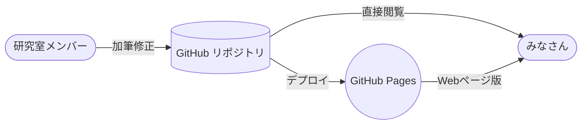

# GitHub.comの見た目のまま、MarkdownをPagesにするやつ

[他のページ](other.md)

[他のページ 2](other-2.md)



$$
\sum_{(授業)}(授業の単位数)\cdot(傾斜)
$$

傾斜は、各授業の成績に対して以下のようにかけられる。

* S -> 7
* A -> 6
* B -> 3
* C -> 1
* D/- -> 0

```c
int main() {
  printf("hello, world\n");
}
```

## 知見をまとめる（本編）

[GitHub Pagesのクイックスタート - GitHub Docs](https://docs.github.com/ja/pages/quickstart)
[レイアウト | Jekyll • シンプルで、ブログのような、静的サイト](http://jekyllrb-ja.github.io/docs/layouts/)

- デフォルトのGitHub Pagesでも、Markdownをそのまま表示できる
- GitHubで使われているMarkdownテーマは、[Primer](https://github.com/pages-themes/primer)だと思う
- `<title>`とかのメタ情報は`_config.yml`における
- `_config.yml`の`title`がページの`<h1>`と一致するとタイトルヘッダ？が表示されなくなるらしい

詳しくは[Configuration | Jekyll • Simple, blog-aware, static sites](https://jekyllrb.com/docs/configuration/)をご覧いただくとして、2023年5月現在、設定されているのは次の項目です。

- Mermaidの使い方は、[Using `mermaid.run`](https://mermaid.js.org/config/usage.html#using-mermaid-run) に全てが書いてあった。

  ```html
  <script type="module">
    import mermaid from 'https://cdn.jsdelivr.net/npm/mermaid@10/dist/mermaid.esm.min.mjs';
    mermaid.initialize({ startOnLoad: false });
    await mermaid.run({
      querySelector: 'pre > code.language-mermaid',
    });
  </script>
  ```

  これでよさそう。
